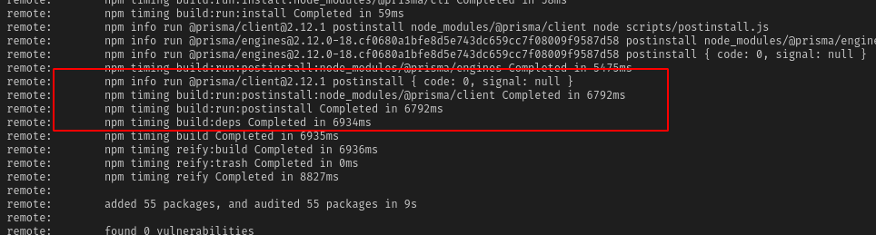

# Prisma-Heroku Postinstall Reproduction

## How to Reproduce

```bash
rm -rf ./.git
git init
git add . 
git commit -m 'Initial commit'
heroku login
heroku apps:create prisma-repoduction
heroku git:remote --app prisma-repoduction
heroku addons:create heroku-postgresql:hobby-dev
heroku pg:credentials:url
```

Now add the Postgres Connection URL to a root `.env` with the name DATABASE_URL. 


```env
DATABASE_URL="postgresql://__USER__:__PASSWORD__@__HOST__:__PORT__/__DATABASE__"
```

```shell
npx prisma migrate save --experimental --name "init"
npx prisma migrate up --experimental
heroku config:set NPM_CONFIG_LOGLEVEL=verbose 
git push heroku main
```

If you look at the build log you will see that the postinstall hook for `@prisma/client` is run. This generates a sudo package in `node_modules/.prisma/client/xx`. 



When the application is then started `.prisma` can not be found. 

For more information about the deployment you may look at this [guide](https://www.prisma.io/docs/guides/deployment/deploying-to-heroku)
